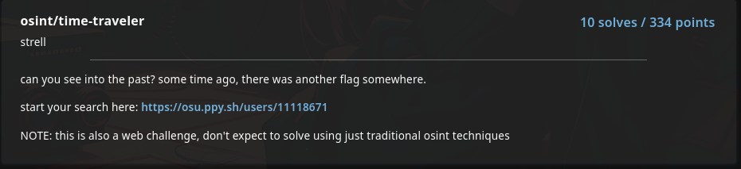
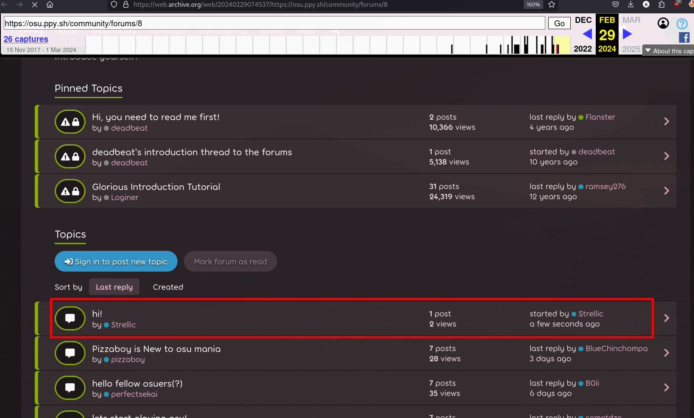
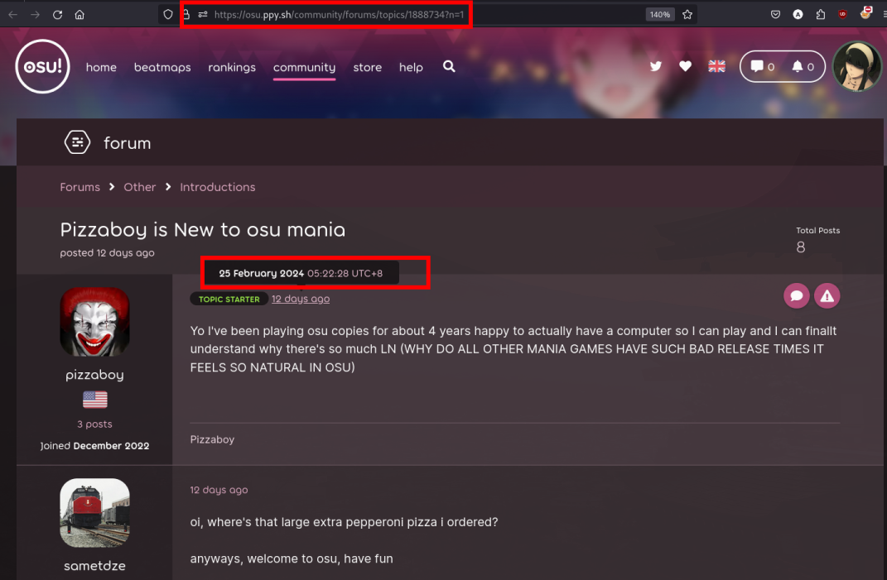

# osu!gaming CTF writeups
Write-up for [osu!gaming CTF](https://ctftime.org/event/2165) OSINT challenge - time-traveler (334 points) 

---

# osint/time-traveler


## OSINT part
We were given https://osu.ppy.sh/users/11118671 which is a profile page for a user Strellic in osu! 


I tried looking around but ultimately was not able to find anything that will help progress.

I went back to focus on the profile page message. I tried looking at Strellic's profile in Wayback machine (a website where we can enter a URL and view the previous versions of a webpage). 

There was a snapshot in February 29 in Strellic's profile.


This leads to another clue that there is a post in the introductions forum page. https://osu.ppy.sh/community/forums/8

Looking around in the live website, I wasn't able to find Strellic's post. I thought of again utilizing the wayback machine again and found something interesting.



Strellic's post was also captured in February 29 in wayback machine. when we hover this post we find crucial information like the date of the post (2024-02-09T07:45:27+00:00) and forum ID.

I tried directly accessing the forum page from its forum ID https://osu.ppy.sh/community/forums/topics/1890614 but I was not able to view it.


## Web part 
After knowing that the flag might be in the deleted post in the introductions forum. The challenge now is to find a way to access a previously post in a forum.

As it turns out there is. After looking around existing post and links in a forum. I was able to find information that helped me solved the challenge.

1. When you create a topic in a forum - like Strellic did. It will generate a topic that looks like this in the URL https://osu.ppy.sh/community/forums/topics/1888734 (post in the screenshots just used as an example)


2. Along with this, there also another link generated called a POST which looks something like this in the URL https://osu.ppy.sh/community/forums/posts/9448728. Accessing this directly just redirects you to the forum topic.

3. However, accessing the specific post by accessing the /raw endpoint will redirect you to the actual message of that post https://osu.ppy.sh/community/forums/posts/9448728/raw?quote=1


4. I also found out that even deleted post in the forum can be viewed using this /raw endpoint. For example, I created a post in the introductions page and took note of the URL. I was able to access it even when deleted
https://osu.ppy.sh/community/forums/posts/9463478/raw?quote=1 (this does not work now but it would look something like this)


This is helpful because if we find out the ID of Strellic's post we would be able to view his message.

## IDOR + Binary Search
The POST ID is incremental, which means we can view the post. However simply decrementing the POST ID will take a long time and too many request. 

I found out a faster way by just accessing the URL without adding the endpoint. Using this scheme will redirect to the POST which will reveal the date and time  
https://osu.ppy.sh/community/forums/posts/9448728. Since this is being redirected. 



Since we know that Strellic's deleted post was from February 29. I just needed to find a post posted in February 29 to narrow down the search. I did this in the browser and just looked at the post date.

For example. 

https://osu.ppy.sh/community/forums/posts/9448728 - February 25 <br>
https://osu.ppy.sh/community/forums/posts/9450728 - February 26 <br>
https://osu.ppy.sh/community/forums/posts/9455728 - March 1 <br>
... <br>
https://osu.ppy.sh/community/forums/posts/9454300 - February 29 <br>

Then starting from this ID we can increment it to find Strellic post using the /raw endpoint. Here is the script i used:
```python
def find_strellic():
    start = 9454300
    end = 9455000
    headers = {
        "Cookie": <redacted>
    }
    for i in range(start, end):
        print(f"requesting {i}...", end="")
        resp = requests.get(f"https://osu.ppy.sh/community/forums/posts/{i}/raw?quote=1", headers=headers)
        print(resp.status_code)
        # request the page again while 429 is response
        while resp.status_code == 429:
            time.sleep(20)
            print(f"requesting {i}...", end="")
            resp = requests.get(f"https://osu.ppy.sh/community/forums/posts/{i}/raw?quote=1", headers=headers)
            print(resp.status_code)
        # flag 
        if "Strellic" in resp.text:
            print(resp.text)
            break
        
```

The flag was found in https://osu.ppy.sh/community/forums/posts/9454307/raw?quote=1


flag: **osu{w4it_are_y0u_a_t1me_tr4veler}**


