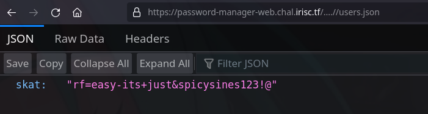
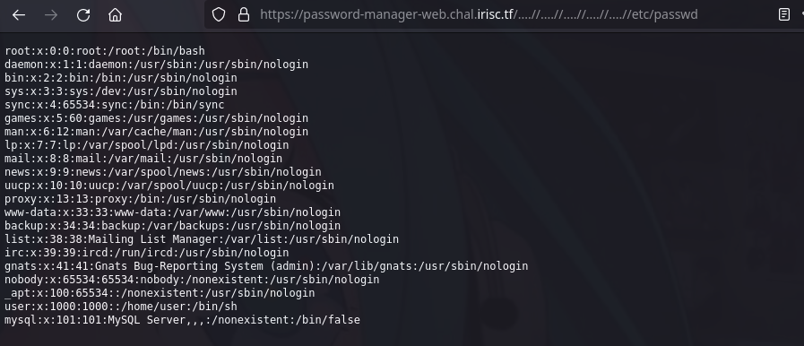
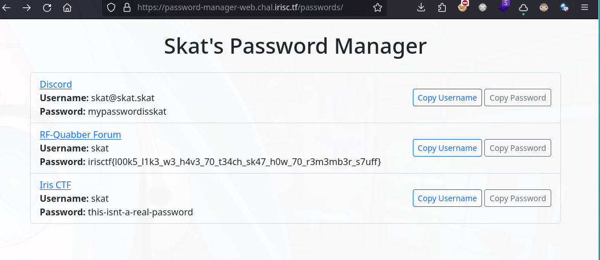
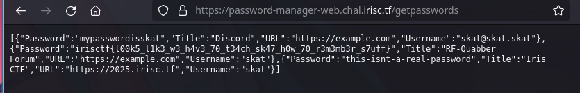

# Password Manager
It looks like skat finally remembered to use his password manager! One small problem though, he forgot his password to the password manager!

Can you help him log back in so he can get back to his favorite RF forums?

author: User
> We are provided a main.go server file which looks like a password manager app with a standard login mechanism. 


# Vulnerability
> failed path traversal protection from line 25 and allowed server hosting of any file path as long as it exist in the OS. 

non-recursive string replacer does not actually prevent path traversal 
```go
 25 var PathReplacer = strings.NewReplacer(
 26     "../", "",
 27 )
```
>**strings.NewReplacer() Function** in Golang returns a new Replacer from a list of previous, new string sets. Substitutions are performed within the order they show up within the target string, without overlapping matches. The old string comparisons are done in argument order. The old string comparisons are done in argument order.

I observe that it allows serving other paths when page is not in the defined routes
```go
207     fullPath := "./pages" + path
208 
209     if _, err := os.Stat(fullPath); os.IsNotExist(err) {
210         notfound(w, r)
211         return
212     }
213 
214     http.ServeFile(w, r, fullPath)
```

Also found an important file `users.json called during initialization which can be used for path traversal
```go
 64     // Initialize users var
 65     file, err := os.Open("./users.json")
 66     if err != nil {
 67         fmt.Printf("Error reading users.json: %v\n", err)
 68         return
 69     }
 70 
 71     if err := json.NewDecoder(file).Decode(&users); err != nil {
 72         fmt.Printf("Error reading users.json: %v\n", err)
 73         return
 74     }
```

# Exploit
The path works like this in the backend. Most web files are under `/pages` 
- path `/index.html` > `./pages/index.html`
- path `/users.json` > `./pages/users.json` which does not exist because users.json is in the root of working directory
- path `../users.json` > `./pages/../users.json` but the filter - `../` prevents from navigating back
- exploit using `....//` as it would only filter out the first iteration resulting into `../users.json` getting passed to the fullPath var

https://password-manager-web.chal.irisc.tf/....//users.json





User credentials can be used to login
`skat	"rf=easy-its+just&spicysines123!@"`


The flag can also found in the /getpasswords showing all entries in the passwords database raw



flag:  `irisctf{l00k5_l1k3_w3_h4v3_70_t34ch_sk47_h0w_70_r3m3mb3r_s7uff}`